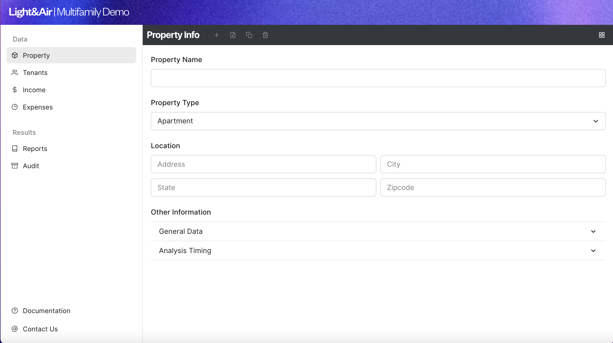
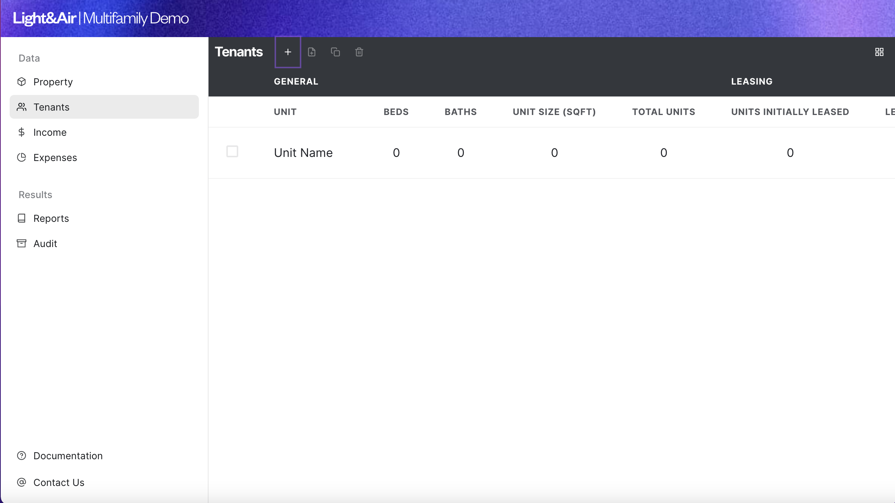
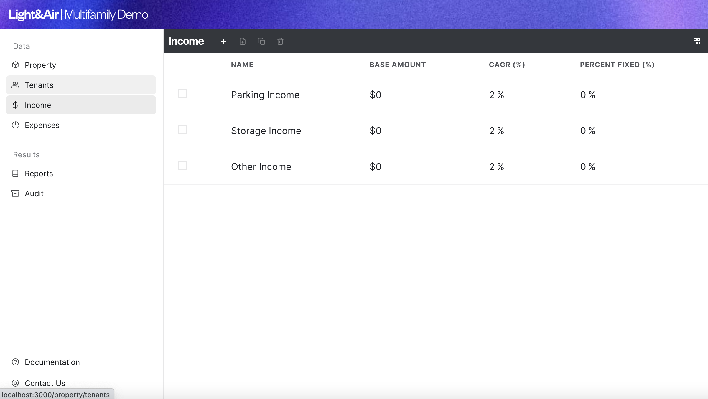

# Light & Air

Modern Multifamily Real Estate Software built using NextJS (Typescript) and FastAPI (Python)
*** Please note: if you are testing, there is no landing page. The app begins at the url route "/property".

To Run:

```
yarn install
yarn dev
```

Accompanying API which has not been conncected yet, but that works independently using request data:
[Core Calculation API](https://github.com/Grant-Schwartz/light-air-core)

## Screenshots




